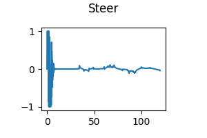

# Vehicle Trajectory Planner

This project implements a 2D controller for autonomous vehicle navigation using the CARLA simulator as part of the "Introduction to Self-Driving Cars" course. The controller combines longitudinal speed control and lateral steering control to follow a predefined set of waypoints.

## Project Overview

The project demonstrates fundamental autonomous vehicle control concepts by implementing:

1. **Longitudinal Controller**: PID-based speed control to maintain desired velocity
2. **Lateral Controller**: Pure pursuit algorithm for path following and steering control
3. **Waypoint Navigation**: Following a sequence of waypoints with associated target speeds
4. **CARLA Integration**: Real-time control of a simulated vehicle in the CARLA environment

## Architecture

### Core Components

#### `controller2d.py`
The main controller class that implements the vehicle control logic:

- **Controller2D**: Main class handling both longitudinal and lateral control
- **Longitudinal Control**: PID controller for throttle/brake commands
- **Lateral Control**: Pure pursuit algorithm for steering commands
- **Waypoint Management**: Tracking closest waypoints and desired speeds

#### `module_7.py`
Supporting functions for CARLA simulation and demonstration:

- **CARLA Settings**: Configuration for the simulation environment
- **Pose Management**: Vehicle position and orientation tracking
- **Control Commands**: Interface for sending throttle, steering, and brake commands
- **Data Logging**: Trajectory recording and visualization
- **Main Demo**: Complete waypoint navigation demonstration

## Control Algorithms

### Longitudinal Controller (PID)

The speed controller uses a PID (Proportional-Integral-Derivative) approach:

```
error = v_desired - v_current
signal = kp * error + ki * integral_term + kd * diff_term
```

**Parameters:**
- `kp = 2.0`: Proportional gain
- `ki = 0.05`: Integral gain
- `kd = 0.01`: Derivative gain

**Output Logic:**
- Positive signal → Throttle command (0-1)
- Negative signal → Brake command (0-1)

### Lateral Controller (Pure Pursuit)

The steering controller implements the pure pursuit algorithm:

1. **Lookahead Distance**: `ld = v * k + ld_min`
   - `k = 0.1`: Velocity-dependent factor
   - `ld_min = 1.0`: Minimum lookahead distance

2. **Target Point Selection**: Find waypoint at lookahead distance ahead

3. **Steering Angle Calculation**:
   ```
   alpha = arctan2(yt - y, xt - x) - yaw
   steer_output = arctan2(2 * L * sin(alpha), ld)
   ```
   - `L = 3.0`: Vehicle wheelbase
   - `alpha`: Angle between vehicle heading and target point

## Features

### Vehicle State Management
- Real-time tracking of position (x, y)
- Orientation (yaw angle)
- Forward velocity
- Timestamp and frame counting

### Waypoint System
- Waypoints format: `[x, y, desired_speed]`
- Dynamic waypoint updates
- Closest waypoint identification
- Speed profile following

### Control Output
- Throttle: 0.0 to 1.0 (acceleration)
- Steering: -1.22 to 1.22 radians (-70° to 70°)
- Brake: 0.0 to 1.0 (deceleration)

### Persistent Variables
The controller maintains state between iterations:
- Previous velocity and time
- Previous error and integral error
- Previous throttle command

## Usage

### Prerequisites
- CARLA Simulator installed and running
- Python 3.x
- NumPy library
- `cutils` module for persistent variables

### Running the Controller

1. **Initialize Controller**:
   ```python
   waypoints = [[x1, y1, v1], [x2, y2, v2], ...]
   controller = Controller2D(waypoints)
   ```

2. **Update Vehicle State**:
   ```python
   controller.update_values(x, y, yaw, speed, timestamp, frame)
   ```

3. **Compute Control Commands**:
   ```python
   controller.update_controls()
   throttle, steer, brake = controller.get_commands()
   ```

4. **Send Commands to Vehicle**:
   ```python
   # Commands are automatically applied via CARLA interface
   ```

### Running the Demo

Execute the main waypoint navigation demonstration:

```bash
python module_7.py
```

This will:
- Initialize CARLA simulation
- Load predefined waypoints
- Run the autonomous navigation loop
- Log trajectory data
- Generate performance plots

## Configuration

### Controller Tuning

**PID Parameters** (in `controller2d.py`):
```python
ki = 0.05  # Integral gain
kp = 2     # Proportional gain
kd = 0.01  # Derivative gain
```

**Pure Pursuit Parameters**:
```python
k = 0.1      # Lookahead gain
ld_min = 1.0 # Minimum lookahead distance
L = 3.0      # Vehicle wheelbase
```

### Simulation Settings

Modify CARLA settings in `module_7.py`:
- Weather conditions
- Traffic density
- Map selection
- Sensor configurations

## Performance Metrics

The system tracks several performance indicators:
- **Path Following Error**: Distance from vehicle to desired path
- **Speed Tracking**: Deviation from target speeds
- **Control Smoothness**: Rate of change in steering and throttle
- **Trajectory Completion**: Successful waypoint navigation

## Controller Output Analysis

### Trajectory Data

The controller outputs trajectory data to `controller_output/trajectory.txt` with the following format:
```
x_position, y_position, velocity, timestamp
```

Example trajectory data shows the vehicle successfully navigating waypoints:
- **Starting Position**: (-183.8, 80.2) at t=0.0s
- **Final Position**: (27.7, -619.3) at t=102.3s
- **Total Distance**: ~700 meters
- **Maximum Speed**: ~22.4 m/s

### Performance Visualizations

The controller automatically generates the following performance plots in the `controller_output/` directory:

#### 1. Vehicle Trajectory


The trajectory plot shows the actual path taken by the vehicle through the waypoint sequence. The smooth, continuous path demonstrates effective lateral control with the pure pursuit algorithm.

#### 2. Forward Speed Profile


The speed profile shows the vehicle's velocity over time, demonstrating the PID controller's ability to maintain target speeds and smoothly accelerate/decelerate as needed.

#### 3. Throttle Commands


The throttle output plot shows the longitudinal controller's throttle commands over time, indicating smooth acceleration control without excessive oscillation.

#### 4. Brake Commands


The brake output demonstrates the controller's deceleration commands, showing when and how the vehicle reduces speed during the trajectory.

#### 5. Steering Commands


The steering output plot shows the lateral controller's steering angle commands over time, demonstrating the pure pursuit algorithm's smooth path following behavior.

### Key Performance Observations

From the controller output visualizations:
- **Smooth Trajectory**: Clean, continuous path with no sharp deviations or oscillations
- **Effective Speed Control**: Gradual acceleration from 0 to ~22 m/s with smooth transitions
- **Stable Steering**: Steering commands show appropriate responses without over-correction
- **Coordinated Control**: Throttle and brake commands work together for optimal speed regulation
- **Successful Navigation**: Complete waypoint sequence traversed in ~102 seconds
- **Control Smoothness**: All control outputs demonstrate stable, non-oscillatory behavior

## References

- CARLA Simulator Documentation
- "Introduction to Self-Driving Cars" Course Materials
- Pure Pursuit Algorithm Literature
- PID Control Theory and Applications

---

*This project is part of the "Introduction to Self-Driving Cars" course and serves as a practical implementation of vehicle trajectory planning using a 2D controller in a simulated environment.*
